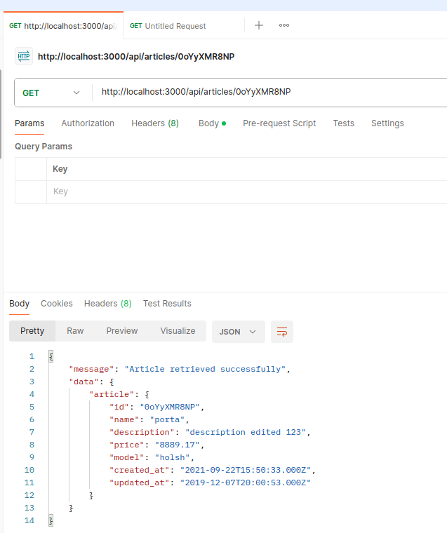
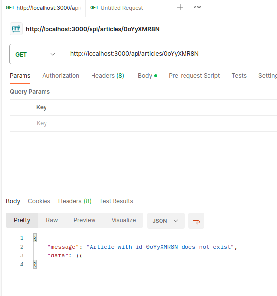
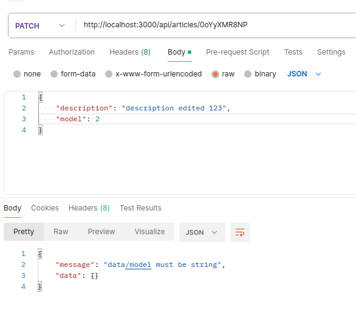
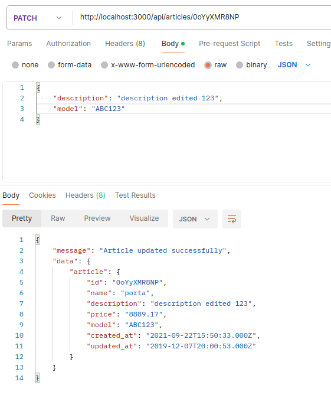
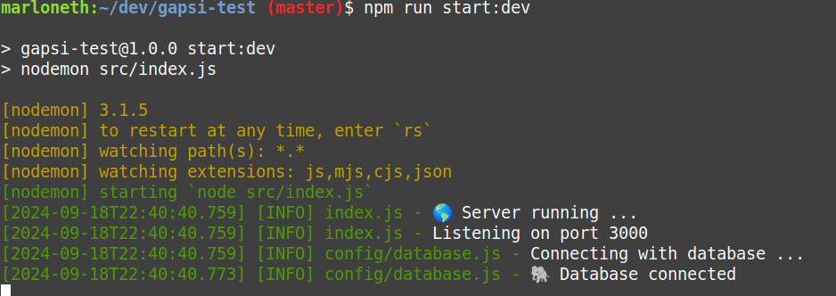

# Articles API

This is just a small API to handle some logic retrieving and editing articles in a Postgresql database.

## Installation

### Requirements

- Node v20.10.0
- Git (for clone the repo)

### Steps

1. Clone the repository on your local machine.

```sh
git clone git@github.com:marloneth/gapsi-test.git
```

2. Create a new `.env` file on your root directory.

```sh
cd gapsi-test
touch .env
```

3. Fill the `.env` file with the required env variables, please take a look at `.env.example` to know what variables you need.

4. Install dependencies

```sh
npm install
```

5. Done. The server is ready to be run.

## Run the server

To run the server you have two options:

1. Run it in development mode.

```sh
npm run start:dev
```

2. Build it and run it in production mode.

```sh
npm run start
npm run start:prod
```

## SQL

In the folder `sql` located on the root folder we can find a couple of SQL scripts:

- `creation.sql`: Use it if you want to create the needed table on your database.
- `populate.sql`: Use it to populate the table mentioned above with some data.

## Evidences










